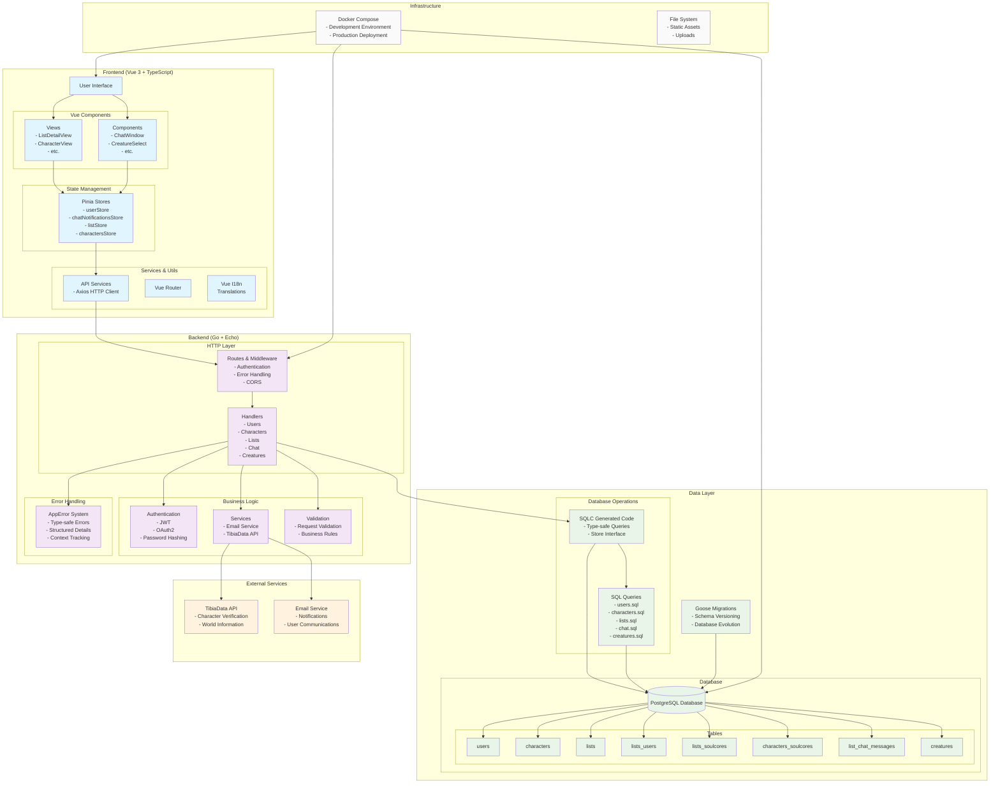

# TibiaCores Architecture Diagram

## Key Architecture Components

### Frontend Architecture
- **Vue 3 with Composition API**: Modern reactive framework
- **TypeScript**: Type safety throughout the frontend
- **Pinia**: Centralized state management
- **TailwindCSS**: Utility-first styling
- **Vue I18n**: Internationalization support

### Backend Architecture
- **Echo Framework**: Fast HTTP router and middleware
- **SQLC**: Type-safe database queries from SQL
- **Custom Error System**: Structured error handling with context
- **JWT Authentication**: Secure user sessions
- **OAuth2**: Third-party authentication integration

### Database Design
- **PostgreSQL**: Robust relational database
- **Goose Migrations**: Version-controlled schema changes
- **Normalized Schema**: Efficient data relationships
- **UUID Primary Keys**: Globally unique identifiers

### Key Data Relationships
- Users can have multiple Characters
- Characters can be members of multiple Lists
- Lists contain Soul Cores with tracking states
- Characters can own Soul Cores (obtained/unlocked states)
- Lists have Chat functionality for member communication

### External Integrations
- **TibiaData API**: Character verification and game data
- **Email Services**: User notifications and communications
- **Docker**: Containerized development and deployment

### Testing Strategy
- **Backend**: Unit tests with gomock for database mocking
- **Frontend**: Component and integration testing
- **Type Safety**: SQLC and TypeScript provide compile-time safety
